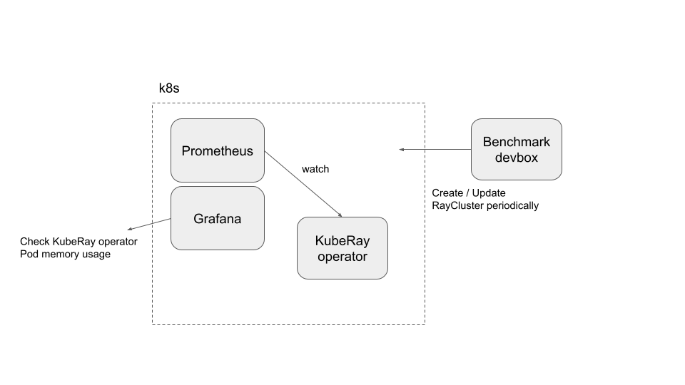
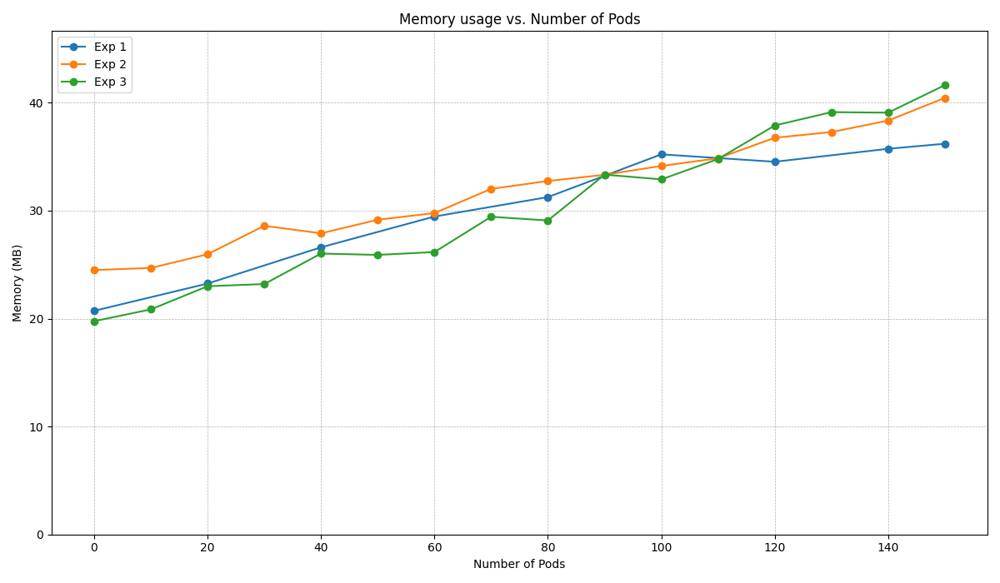

(kuberay-mem-scalability)=

# KubeRay memory and scalability benchmark

## Architecture



This architecture is not a good practice, but it can fulfill the current requirements.

## Preparation

Please clone the [KubeRay repository](https://github.com/ray-project/kuberay) and checkout the `master` branch.
This tutorial requires several files in the repository.

## Step 1: Create a new Kubernetes cluster

We will create a GKE cluster with autoscaling enabled.
The following command creates a Kubernetes cluster named `kuberay-benchmark-cluster` on Google GKE.
The cluster can scale up to 16 nodes, and each node of type `e2-highcpu-16` has 16 CPUs and 16 GB of memory.
The following experiments may create up to ~150 Pods in the Kubernetes cluster, and each Ray Pod requires 1 CPU and 1 GB of memory.

```sh
gcloud container clusters create kuberay-benchmark-cluster \
    --num-nodes=1 --min-nodes 0 --max-nodes 16 --enable-autoscaling \
    --zone=us-west1-b --machine-type e2-highcpu-16
```

## Step 2: Install Prometheus and Grafana

```sh
# Path: kuberay/
./install/prometheus/install.sh
```

Follow "Step 2: Install Kubernetes Prometheus Stack via Helm chart" in [prometheus-grafana.md](https://github.com/ray-project/kuberay/blob/master/docs/guidance/prometheus-grafana.md#step-2-install-kubernetes-prometheus-stack-via-helm-chart) to install the [kube-prometheus-stack v48.2.1](https://github.com/prometheus-community/helm-charts/tree/kube-prometheus-stack-48.2.1/charts/kube-prometheus-stack) chart and related custom resources.

## Step 3: Install a KubeRay operator

Follow [this document](kuberay-operator-deploy) to install the latest stable KubeRay operator via Helm repository.

## Step 4: Run experiments

* Step 4.1: Make sure the `kubectl` CLI can connect to your GKE cluster. If not, please run `gcloud auth login`.
* Step 4.2: Run an experiment
  ```sh
  # You can modify `memory_benchmark_utils` to run the experiment you want to run.
  # (path: benchmark/memory_benchmark/scripts)
  python3 memory_benchmark_utils.py | tee benchmark_log
  ```
* Step 4.3: Follow [prometheus-grafana.md](https://github.com/ray-project/kuberay/blob/master/docs/guidance/prometheus-grafana.md#step-2-install-kubernetes-prometheus-stack-via-helm-chart) to access Grafana's dashboard.
  * Sign into the Grafana dashboard.
  * Click on "Dashboards"
  * Select "Kubernetes / Compute Resources / Pod"
  * You will see the "Memory Usage" panel for the KubeRay operator Pod.
  * Select the time range, then click on "Inspect" followed by "Data" to download the memory usage data of the KubeRay operator Pod.
* Step 4.4: Delete all RayCluster custom resources.
  ```sh
  kubectl delete --all rayclusters.ray.io --namespace=default
  ```
* Step 4.5: Repeat Step 4.2 to Step 4.4 for other experiments.

# Experiments

We've designed three benchmark experiments:

* Experiment 1: Launch a RayCluster with 1 head and no workers. A new cluster is initiated every 20 seconds until there are a total of 150 RayCluster custom resources.
* Experiment 2: In the Kubernetes cluster, there is only 1 RayCluster. Add 5 new worker Pods to this RayCluster every 60 seconds until the total reaches 150 Pods.
* Experiment 3: Create a 5-node (1 head + 4 workers) RayCluster every 60 seconds until there are 30 RayCluster custom resources.

Based on [the survey](https://forms.gle/KtMLzjXcKoeSTj359) for KubeRay users, we decided to set our benchmark target at 150 Ray Pods which can cover most use cases.

## Experiment results (KubeRay v0.6.0)



* You can generate the figure by running:
  ```sh
  # (path: benchmark/memory_benchmark/scripts)
  python3 experiment_figures.py
  # The output image `benchmark_result.png` will be stored in `scripts/`.
  ```

* As shown in the figure, the memory usage of the KubeRay operator Pod is highly positively correlated to the number of Pods in the Kubernetes cluster.
In addition, the number of custom resources in the Kubernetes cluster does not have a big impact on the memory usage.
* Note that the x-axis "Number of Pods" is the number of Pods that are created rather than running.
If the Kubernetes cluster does not have enough computing resources, the GKE Autopilot will add a new Kubernetes node into the cluster.
This process may take a few minutes, so some Pods may be pending in the process.
This may be the reason why the memory usage is somewhat throttled.